По договоренности с заказчицей решили сделать кастомную админку. Общий внешний вид:

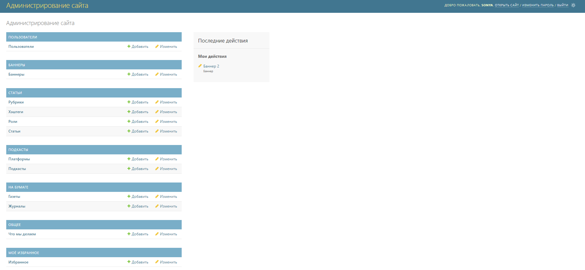

Далее идут скрины соответствующих разделов. Данные, которыми заполнена база, являются тестовыми, поэтому не стоит ориентироваться на их содержание, только на форму.

Что мы делаем:

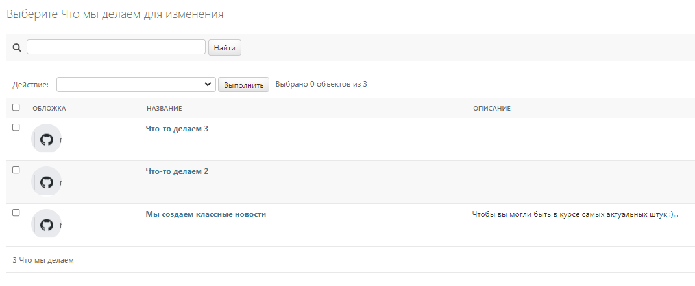

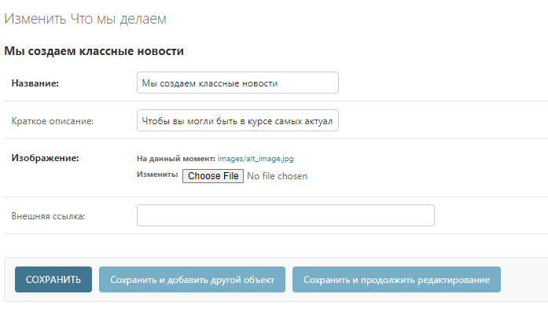

Пользователи:

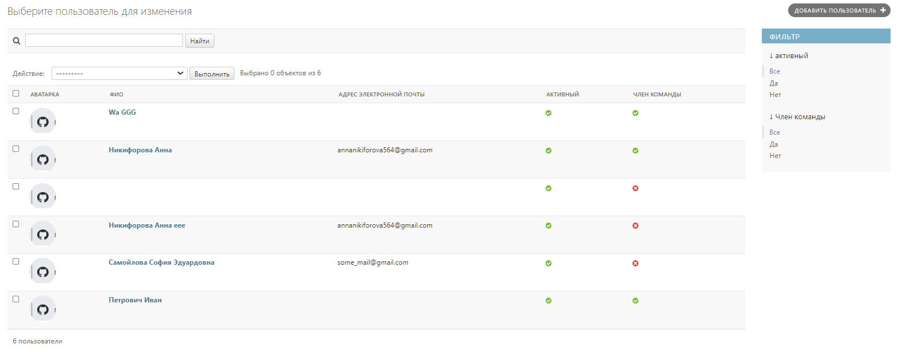

Админ может изменять только свою учетную запись, а также настройки всех пользователей, свзяанные с администрированием.

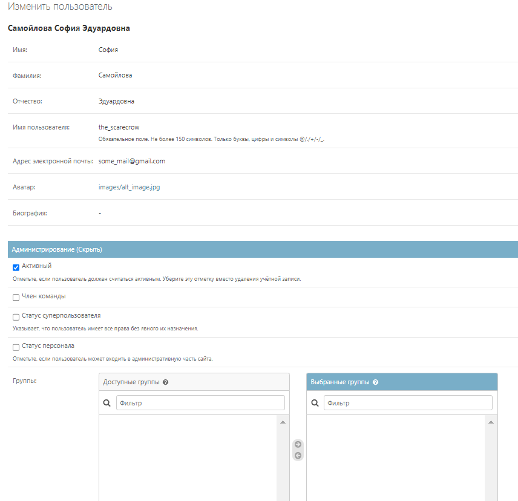

Рубрики и хэштеги.

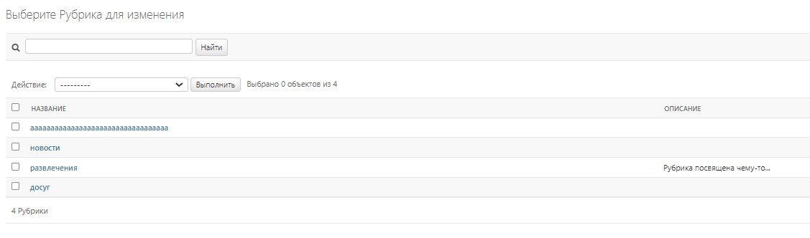

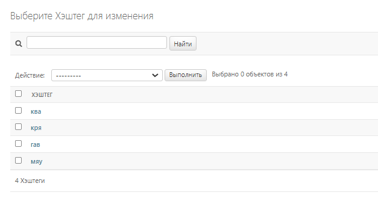

Статьи. Интерфейс редактирования статей.

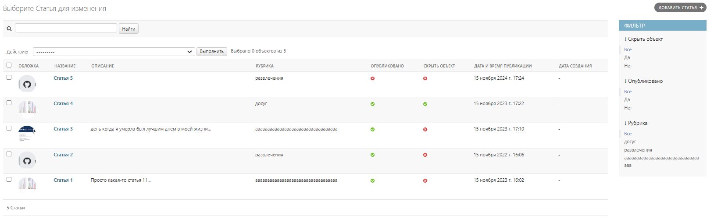

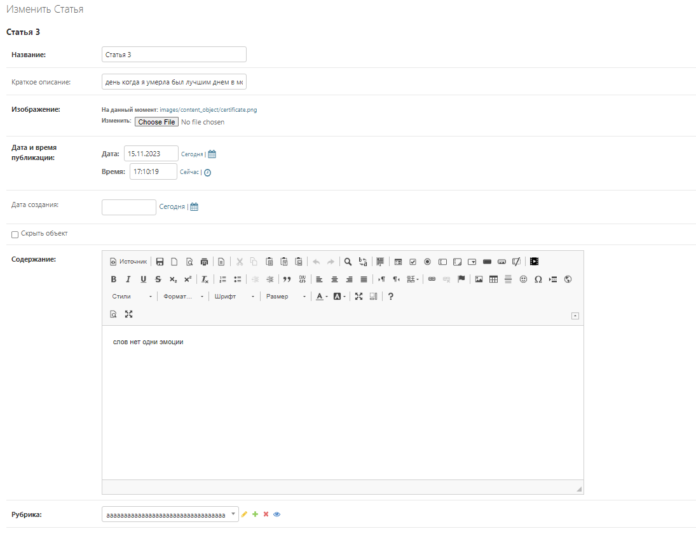

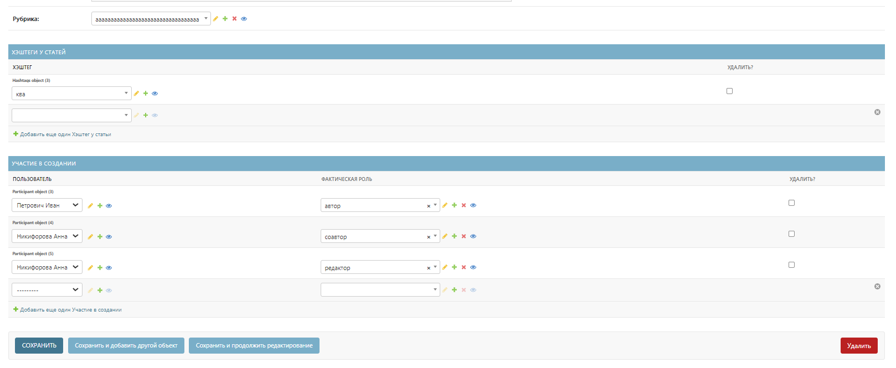

Баннер. Интерфейс редактирования баннера.

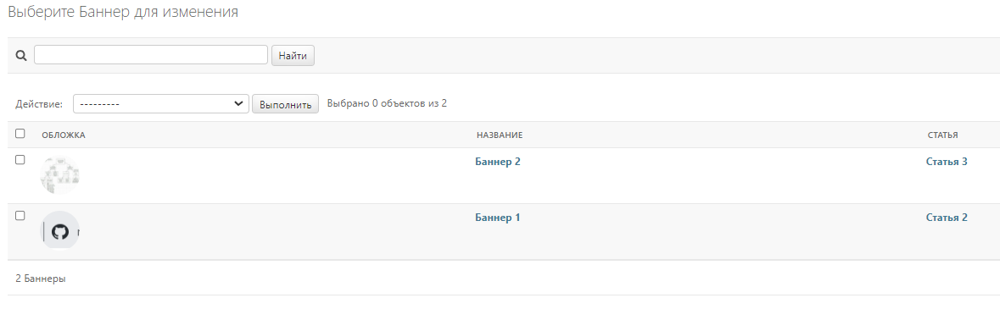

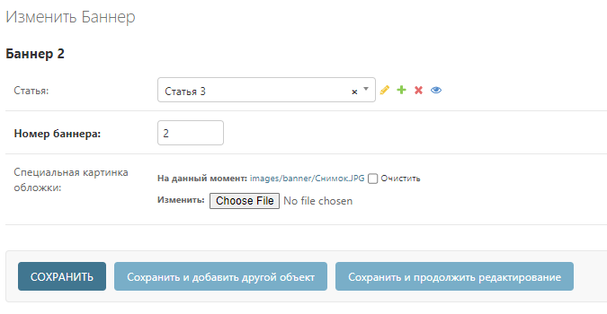

Платформа.

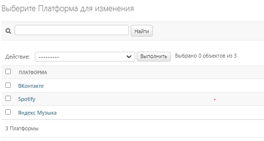

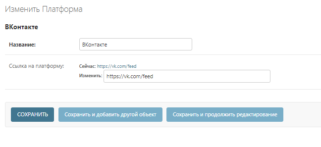

Подкасты в совокупности с выпусками подкастов.

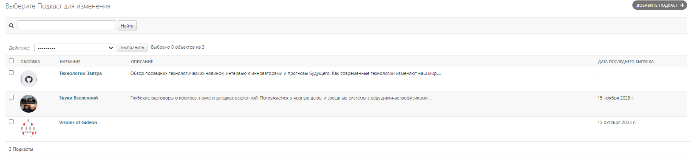

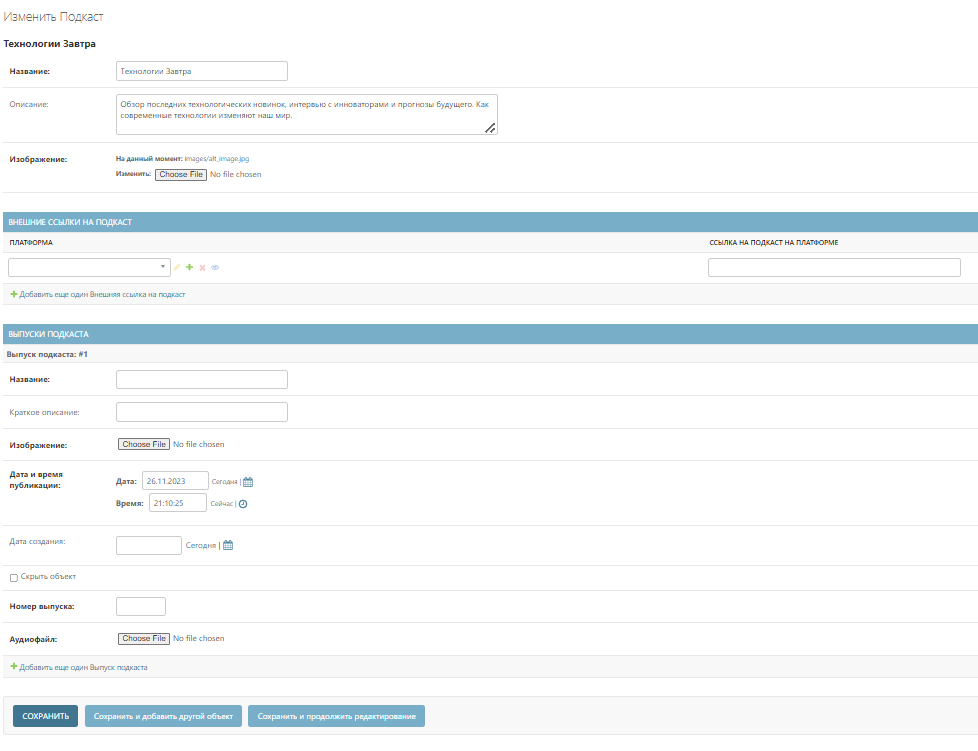

Публикации на бумаге (газеты и журналы имеют одинаковый интерфейс).

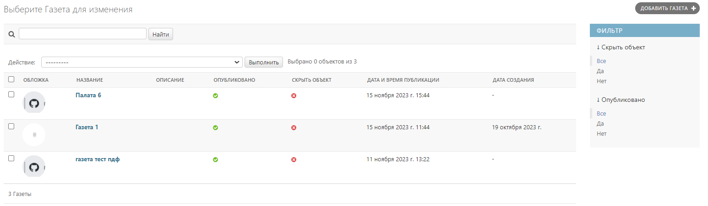

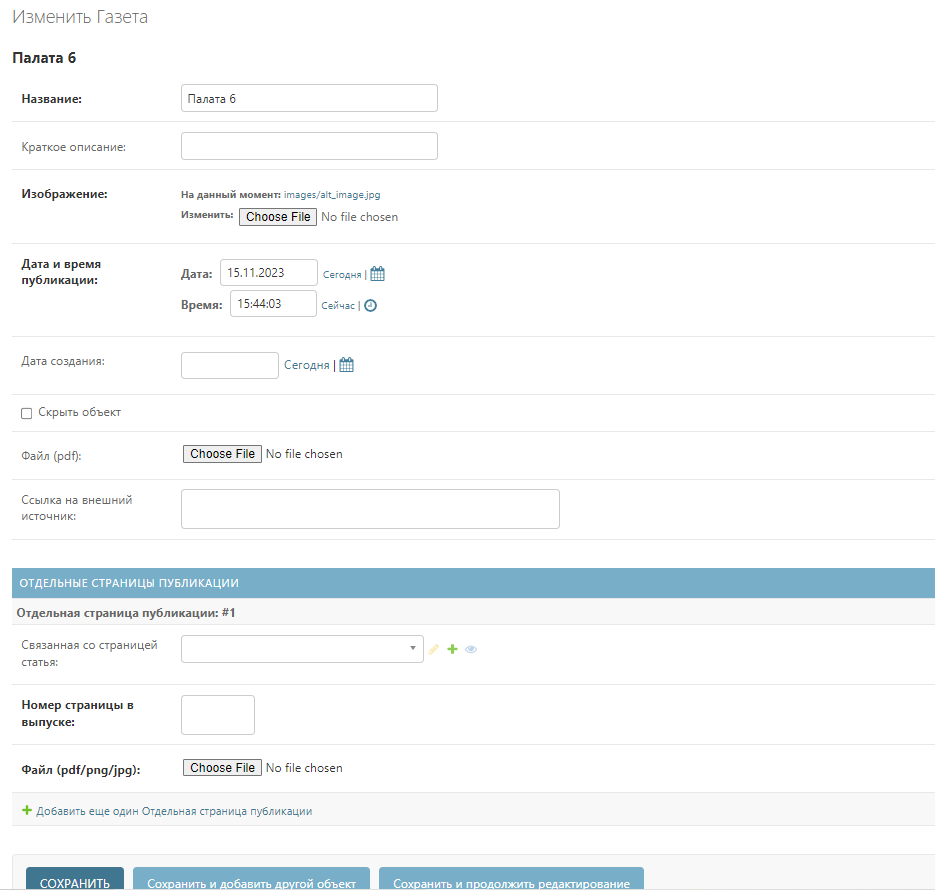

Избранное. Админ может видеть и редактировать собственное избранное, но не избранное любого пользователя.

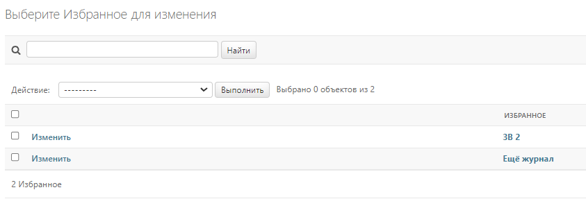

