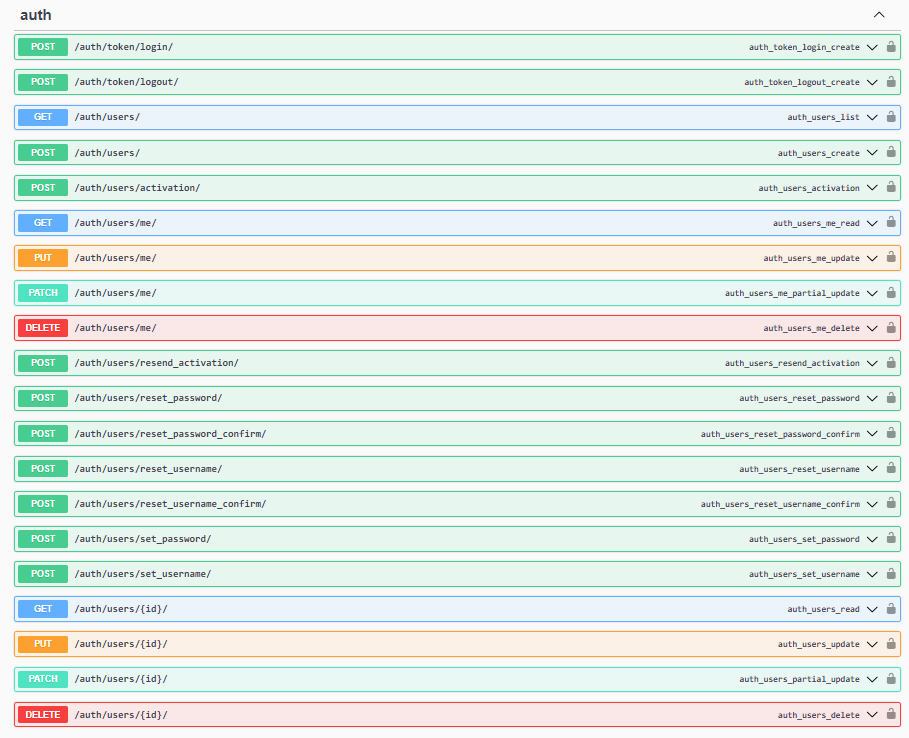
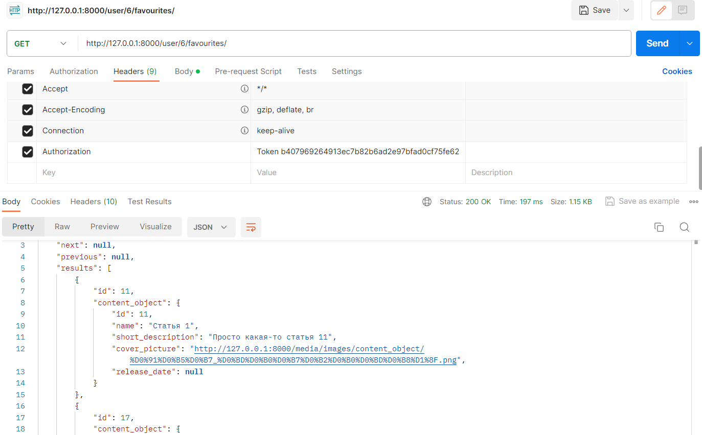
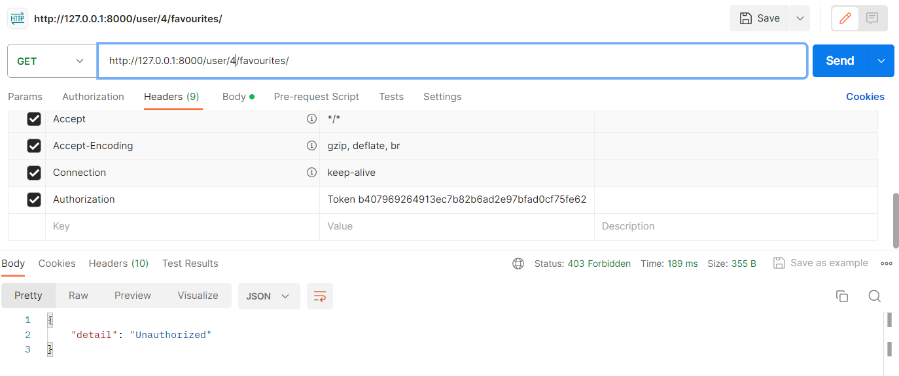
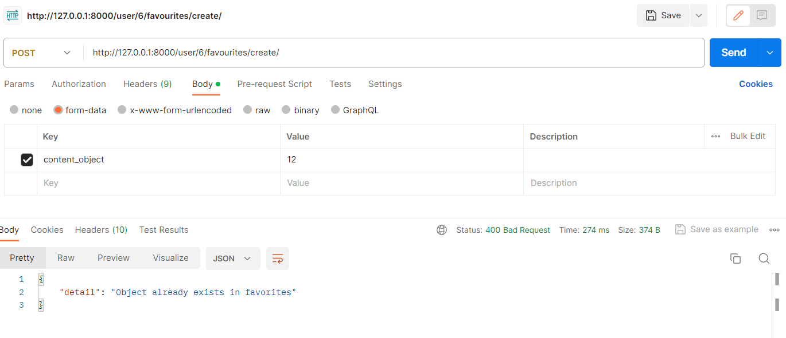
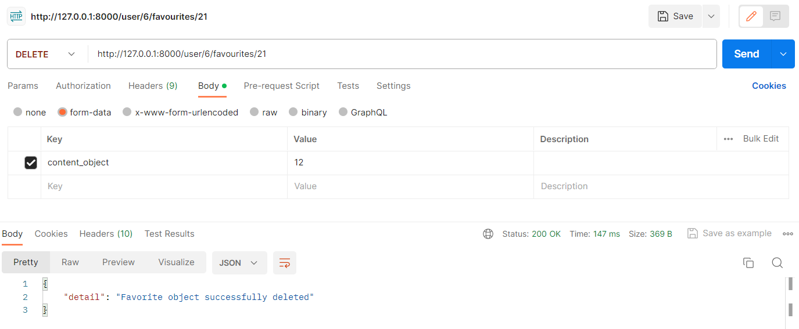

По ТЗ в данной лабораторной необходимо было настроить регистрацию, авторизацию и работу с пользователем через djoser. Функции, которые djoser предоставляет по умолчанию:

Избранное (текущий пользователь имеет id 6):

Добавление в Избранное:

Удаление:

