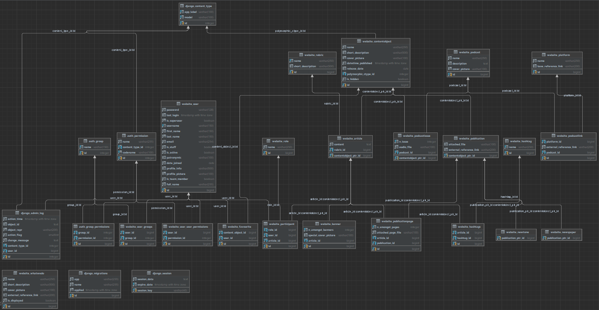

Схема базы данных выглядит следующим образом:



Более подробно поясню, какие модели существуют.

Ни с чем не связанная модель "Что мы делаем". Это просто совокупность названия, описания, картинки и ссылки, ведущей на внешний ресурс. Визиточная часть сайта. 
```python
class WhatWeDo(models.Model):
    """ Что мы делаем помимо представленного на сайте """
    name = models.CharField(max_length=250, null=False, verbose_name="Название")
    short_description = models.CharField(max_length=500, null=True, blank=True, verbose_name="Краткое описание")
    cover_picture = models.ImageField(
        upload_to='images/what_we_do/',
        null=True,
        default='images/alt_image.jpg',
        verbose_name="Изображение"
    )
    external_reference_link = models.URLField(null=True, blank=True, verbose_name="Внешняя ссылка")

    def __str__(self):
        return self.name

    class Meta:
        verbose_name = "Что мы делаем"
        verbose_name_plural = "Что мы делаем"
```

Рубрика. Рубрик ограниченное количество, никакая статья (см. далее) не может быть вне рубрики.
```python
class Rubric(models.Model):
    """ Рубрика """
    name = models.CharField(max_length=250, null=False, unique=True, verbose_name="Название")
    short_description = models.CharField(max_length=500, null=True, blank=True, verbose_name="Краткое описание")

    def __str__(self):
        return self.name

    class Meta:
        verbose_name = "Рубрика"
        verbose_name_plural = "Рубрики"
```

Объект контента. Это полиморфичная модель (что-то вроде абстрактного класса, но в БД реализуется через связь один-к-одному). Наличие такой модели продиктовано принципами ООП.
```python
from django.db import models
from django.utils import timezone
from polymorphic.models import PolymorphicModel  # https://django-polymorphic.readthedocs.io/en/latest/


def get_curr_time_plus_interval(interval_minutes=5):
    """ Функция для установки значения по умолчанию для datetime_published """
    return timezone.now() + timezone.timedelta(minutes=interval_minutes)


# display only if (is_piblished and not is_hidden)
class ContentObject(PolymorphicModel):
    """ Базовый объект контента """
    name = models.CharField(max_length=250, null=False, verbose_name="Название")
    short_description = models.CharField(max_length=500, null=True, blank=True, verbose_name="Краткое описание")
    cover_picture = models.ImageField(
        upload_to='images/content_object/',
        null=True,
        default='images/alt_image.jpg',
        verbose_name="Изображение"
    )
    datetime_published = models.DateTimeField(null=False, default=get_curr_time_plus_interval,
                                              verbose_name="Дата и время публикации")
    release_date = models.DateField(null=True, blank=True, verbose_name="Дата создания")
    is_hidden = models.BooleanField(null=False, default=False, verbose_name="Скрыть объект")

    # TODO: add the n_views field and write the logic for auto-update

    @property
    def is_published(self) -> bool:
        """ Проверка, опубликован ли объект """
        return self.datetime_published <= timezone.now()

    def __str__(self):
        return self.name

    class Meta:
        verbose_name = "Базовый объект контента"
        verbose_name_plural = "Базовые объекты контента"
```

Статья. Это объект контента. У неё есть рубрика, а также хэштеги. Хэштегов может быть сколько угодно или не быть. Один и тот же хэштег может быть у разных статей.
```python
from django.db import models
from django.utils import timezone
from polymorphic.models import PolymorphicModel  # https://django-polymorphic.readthedocs.io/en/latest/


def get_curr_time_plus_interval(interval_minutes=5):
    """ Функция для установки значения по умолчанию для datetime_published """
    return timezone.now() + timezone.timedelta(minutes=interval_minutes)


# display only if (is_piblished and not is_hidden)
class ContentObject(PolymorphicModel):
    """ Базовый объект контента """
    name = models.CharField(max_length=250, null=False, verbose_name="Название")
    short_description = models.CharField(max_length=500, null=True, blank=True, verbose_name="Краткое описание")
    cover_picture = models.ImageField(
        upload_to='images/content_object/',
        null=True,
        default='images/alt_image.jpg',
        verbose_name="Изображение"
    )
    datetime_published = models.DateTimeField(null=False, default=get_curr_time_plus_interval,
                                              verbose_name="Дата и время публикации")
    release_date = models.DateField(null=True, blank=True, verbose_name="Дата создания")
    is_hidden = models.BooleanField(null=False, default=False, verbose_name="Скрыть объект")

    # TODO: add the n_views field and write the logic for auto-update

    @property
    def is_published(self) -> bool:
        """ Проверка, опубликован ли объект """
        return self.datetime_published <= timezone.now()

    def __str__(self):
        return self.name

    class Meta:
        verbose_name = "Базовый объект контента"
        verbose_name_plural = "Базовые объекты контента"

        
class Hashtag(models.Model):
    """ Хэштэг """
    name = models.CharField(max_length=250, null=False, unique=True, verbose_name="Название")
    hashtag_articles = models.ManyToManyField('Article', through='Hashtags', verbose_name="Статьи")

    def __str__(self):
        return self.name

    class Meta:
        verbose_name = "Хэштег"
        verbose_name_plural = "Хэштеги"
        

class Hashtags(models.Model):
    """ Хэштеги статьи """
    article = models.ForeignKey('Article', on_delete=models.CASCADE, verbose_name="Статья")
    hashtag = models.ForeignKey('Hashtag', on_delete=models.CASCADE, verbose_name="Хэштег")

    class Meta:
        verbose_name = "Хэштег у статьи"
        verbose_name_plural = "Хэштеги у статей"
```

Баннер. Баннер - это своего рода placeholder для статьи. Их ограниченное количество.
```python
class Banner(models.Model):
    article = models.ForeignKey(Article, null=True, blank=True, on_delete=models.SET_NULL, verbose_name="Статья")
    n_amongst_banners = models.IntegerField(null=False, default=1, unique=True,
                                            validators=[MinValueValidator(1), MaxValueValidator(settings.N_BANNERS)],
                                            verbose_name="Номер баннера")
    special_cover_picture = models.ImageField(upload_to='images/banner/', null=True, blank=True,
                                              verbose_name="Специальная картинка обложки")

    @property
    def cover_picture(self):
        return self.special_cover_picture if self.special_cover_picture else self.article.cover_picture

    def __str__(self):
        return "Баннер " + str(self.n_amongst_banners)

    class Meta:
        verbose_name = "Баннер"
        verbose_name_plural = "Баннеры"

        constraints = [
            models.CheckConstraint(
                check=models.Q(n_amongst_banners__gte=1) & models.Q(n_amongst_banners__lt=settings.N_BANNERS),
                name=f"Может быть только {settings.N_BANNERS} последовательных баннеров",
            )
        ]
```

Подкаст. Подкасты имеют ссылки на платформы, где их можно послушать. Было решено вынести платформу как отдельную сущность. 
```python
class Platform(models.Model):
    """ Внешняя платформа, на которой есть подкаст """
    name = models.CharField(max_length=250, null=False, verbose_name="Название")
    base_reference_link = models.URLField(null=True, blank=True, verbose_name="Ссылка на платформу")

    class Meta:
        verbose_name = "Платформа"
        verbose_name_plural = "Платформы"

    def __str__(self):
        return self.name


class PodcastLink(models.Model):
    """ Ссылка на внешний источник, где можно слушать подкаст """
    podcast = models.ForeignKey(Podcast, on_delete=models.CASCADE, verbose_name="Подкаст")
    platform = models.ForeignKey(Platform, on_delete=models.PROTECT, verbose_name="Платформа")
    external_reference_link = models.URLField(null=False, verbose_name="Ссылка на подкаст на платформе")

    class Meta:
        verbose_name = "Внешняя ссылка на подкаст"
        verbose_name_plural = "Внешние ссылки на подкаст"

    def __str__(self):
        return str(self.platform) + ', ' + str(self.podcast)


class Podcast(models.Model):
    """ Подкаст (как совокупность выпусков) """
    name = models.CharField(max_length=250, null=False, verbose_name="Название")
    description = models.TextField(null=True, blank=True, verbose_name="Описание")
    cover_picture = models.ImageField(upload_to='images/podcast/', null=True,
                                      default='images/alt_image.jpg',
                                      verbose_name="Изображение")
    podcast_platforms = models.ManyToManyField('Platform', through='PodcastLink', verbose_name="Платформы")

    @property
    def issues_count(self):
        return self.podcast_issues.count()

    @property
    def last_published_issue(self):
        return self.podcast_issues.latest('release_date').release_date

    def __str__(self):
        return self.name

    class Meta:
        verbose_name = "Подкаст"
        verbose_name_plural = "Подкасты"
```

У подкастов есть выпуски.
```python
class PodcastIssue(ContentObject):
    """ Выпуск подкаста """
    podcast = models.ForeignKey(Podcast, related_name='podcast_issues', on_delete=models.PROTECT,
                                verbose_name="Подкаст")
    n_issue = models.IntegerField(null=False, verbose_name="Номер выпуска", validators=[MinValueValidator(1)])
    audio_file = models.FileField(upload_to='files/podcasts/', verbose_name="Аудиофайл")  # пока как заглушка

    class Meta:
        verbose_name = "Выпуск подкаста"
        verbose_name_plural = "Выпуски подкаста"

        unique_together = ('podcast', 'n_issue')
        constraints = [
            models.CheckConstraint(
                check=models.Q(n_issue__gte=1),
                name=f"Номер подкаста должен быть положительным числом",
            )
        ]
```

Публикации на бумаге существуют в двух видах: газеты и журналы. Разделить их на два различных объектов было решением заказчицы.
```python
class Publication(ContentObject):  # it is Polymorphic too
    """ Базовая публикация на бумаге """
    attached_file = models.FileField(null=True, blank=True, upload_to="files/publications/", verbose_name="Файл (pdf)")
    external_reference_link = models.URLField(null=True, blank=True, verbose_name="Ссылка на внешний источник")

    class Meta:
        verbose_name = 'Публикация "на бумаге"'
        verbose_name_plural = 'Публикации "на бумаге"'


class Newtone(Publication):
    """ Журнал """

    class Meta:
        verbose_name = "Журнал"
        verbose_name_plural = "Журналы"


class Newspaper(Publication):
    """ Газета """

    class Meta:
        verbose_name = "Газета"
        verbose_name_plural = "Газеты"
```

Далее есть объект Пользователя.
```python
class User(AbstractUser):
    """ Расширение стандартной модели пользователя Django """
    patronymic = models.CharField(max_length=100, null=True, blank=True, verbose_name="Отчество")
    date_joined = models.DateField(null=False, default=timezone.now, verbose_name="Дата регистрации")
    profile_info = models.CharField(max_length=500, null=True, blank=True, verbose_name="Биография")
    profile_picture = models.ImageField(upload_to='images/users/', null=True,
                                        default='images/alt_image.jpg', verbose_name="Аватар")
    is_team_member = models.BooleanField(default=False, verbose_name="Член команды")
    full_name = models.CharField(max_length=255, blank=True,
                                 verbose_name="Полное имя")  # sort of caching for quick search
    article_participated = models.ManyToManyField('Article', through='Participant', related_name='parts',
                                                  verbose_name="Участники в создании")
    favourites = models.ManyToManyField('ContentObject', through='Favourite', related_name='favs',
                                        verbose_name="Избранное")

    REQUIRED_FIELDS = ['email', 'first_name', 'last_name', 'patronymic',
                        'profile_info', 'profile_picture']
    # TODO: create a possibility of logging in via social network

    def calculate_full_name(self):
        return f"{self.last_name} {self.first_name}{' ' + self.patronymic if self.patronymic else ''}"

    def save(self, *args, **kwargs):
        self.full_name = self.calculate_full_name()
        super().save(*args, **kwargs)

    def __str__(self):
        return self.full_name
```

Пользователь имеет Избранное. В Избранное можно добавлять любой Объект контента.
```python
class Favourite(models.Model):
    """ Избранное """
    user = models.ForeignKey(User, on_delete=models.CASCADE, verbose_name="Пользователь")
    content_object = models.ForeignKey(ContentObject, on_delete=models.CASCADE, verbose_name="Объект контента")

    class Meta:
        verbose_name = "Избранное"
        verbose_name_plural = "Избранное"
```

Пользователи, которые являются членами команды, могут принимать участие в создании статей. Информацию об их участии вносит админ. 
```python
class Role(models.Model):
    """ Роль пользователя в создании контента """
    name = models.CharField(max_length=250, null=False, verbose_name="Название")

    def __str__(self):
        return self.name

    class Meta:
        verbose_name = "Роль"
        verbose_name_plural = "Роли"


class Participant(models.Model):
    """ Какую конкретно роль пользователь сыграл при создании """
    user = models.ForeignKey(User, on_delete=models.CASCADE,
                             verbose_name="Пользователь")
    article = models.ForeignKey(Article, on_delete=models.CASCADE, verbose_name="Статья")
    role = models.ForeignKey(Role, null=True, blank=True, on_delete=models.SET_NULL, verbose_name="Фактическая роль")

    def save(self, *args, **kwargs):
        # Check if the user is a team member before saving
        if self.user.is_team_member:
            super().save(*args, **kwargs)
        else:
            raise ValueError("Можно добавить только тех пользователей, которые являются членами команды")

    class Meta:
        verbose_name = "Участие в создании"
        verbose_name_plural = "Участие в создании"
```
