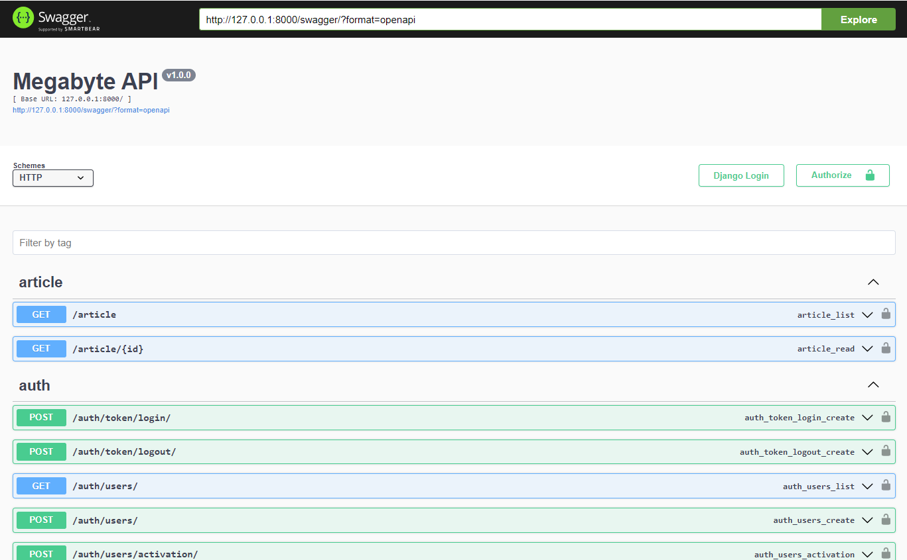
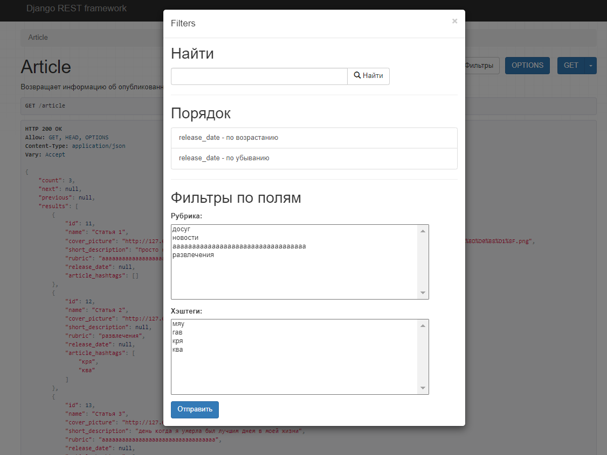
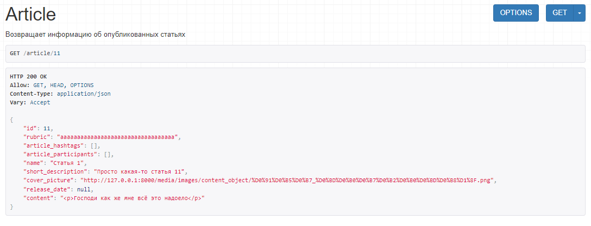
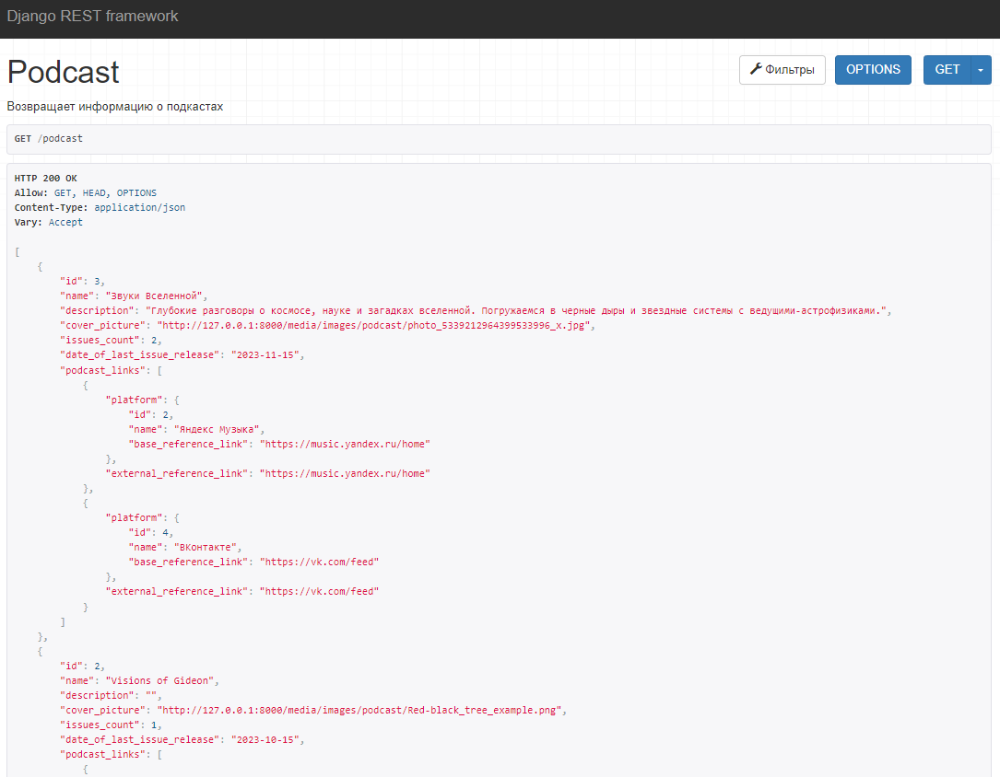
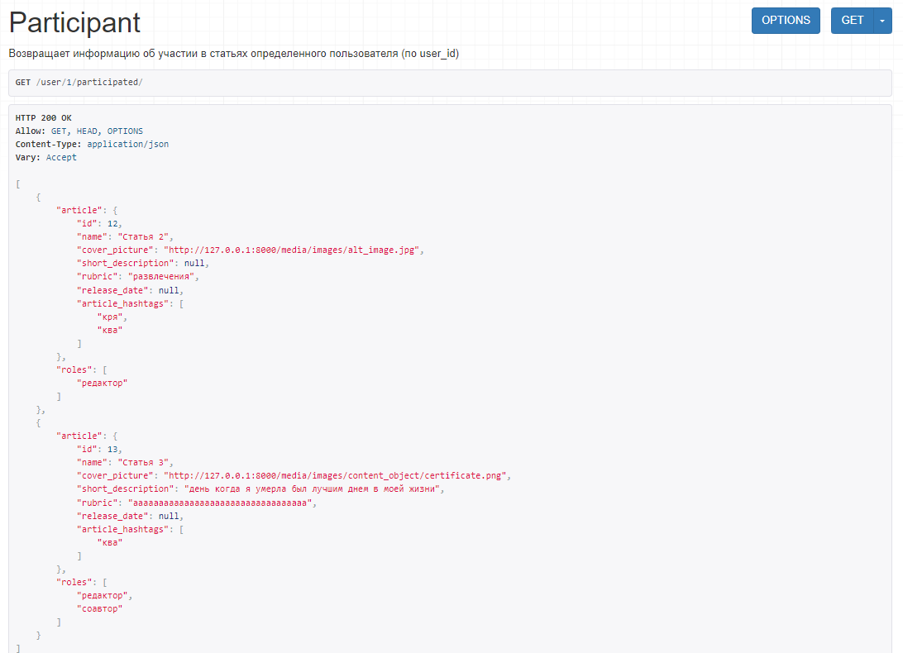

Пути имеют говорящие названия. Всё, кроме Избранного, доступно любому зашедшему пользователю, но только на чтение.

```python
urlpatterns = [
    path(r'whatwedo', RandomWhatWeDoViewSet.as_view({'get': 'list'}), name='whatwedos'),
    path(r'whatwedo/<int:pk>', RandomWhatWeDoViewSet.as_view({'get': 'retrieve'}), name='whatwedo'),

    path(r'rubric', RubricViewSet.as_view({'get': 'list'}), name='rubrics'),
    path(r'rubric/<int:pk>', RubricViewSet.as_view({'get': 'retrieve'}), name='rubric'),

    path(r'hashtag', HashtagViewSet.as_view({'get': 'list'}), name='hashtags'),
    path(r'hashtag/<int:pk>', HashtagViewSet.as_view({'get': 'retrieve'}), name='hashtag'),

    path(r'platform', PlatformViewSet.as_view({'get': 'list'}), name='platforms'),
    path(r'platform/<int:pk>', PlatformViewSet.as_view({'get': 'retrieve'}), name='platform'),

    path(r'article', ArticleViewSet.as_view({'get': 'list'}), name='articles'),
    path(r'article/<int:pk>', ArticleViewSet.as_view({'get': 'retrieve'}), name='article'),

    path(r'banner', BannerViewSet.as_view({'get': 'list'}), name='banners'),
    path(r'banner/<int:pk>', BannerViewSet.as_view({'get': 'retrieve'}), name='banner'),

    path(r'podcast', PodcastViewSet.as_view({'get': 'list'}), name='podcasts'),
    path(r'podcast/<int:pk>', PodcastViewSet.as_view({'get': 'retrieve'}), name='podcast'),

    path(r'podcast/<int:pk>/issues', PodcastIssueViewSet.as_view({'get': 'list'}), name='podcast-issues'),

    path(r'publication', PublicationViewSet.as_view({'get': 'list'}), name='publications'),
    path(r'publication/<int:pk>', PublicationViewSet.as_view({'get': 'retrieve'}), name='publication'),

    path(r'newtone', NewtoneViewSet.as_view({'get': 'list'}), name='newtones'),
    path(r'newtone/<int:pk>', NewtoneViewSet.as_view({'get': 'retrieve'}), name='newtone'),

    path(r'newspaper', NewspaperViewSet.as_view({'get': 'list'}), name='newspaper'),
    path(r'newspaper/<int:pk>', NewspaperViewSet.as_view({'get': 'retrieve'}), name='newspaper'),

    path(r'publication/<int:pk>/pages', PublicationPageViewSet.as_view({'get': 'retrieve'}),
         name='publication-pages'),

    path(r'user/<int:pk>/participated/', ParticipantViewSet.as_view({'get': 'list'}),
         name='user-participated'),  # any user can see it

    path('user/<int:pk>/favourites/', FavouriteListView.as_view(), name='user-favourites'),
    path('user/<int:pk>/favourites/create/', FavouriteCreateView.as_view(), name='user-create-favourite'),
    path('user/<int:user_pk>/favourites/<int:pk>', FavouriteDeleteView.as_view(), name='user-delete-favourite'),

    path('swagger/', schema_view.with_ui('swagger', cache_timeout=0), name='schema-swagger-ui'),
    path('redoc/', schema_view.with_ui('redoc', cache_timeout=0), name='schema-redoc'),
]
```

Пример view для статьи.

```python
# views.py
class ArticleViewSet(viewsets.ReadOnlyModelViewSet):
    """ Возвращает информацию об опубликованных статьях """
    queryset = Article.objects.filter(
        is_hidden=False,
        datetime_published__lte=timezone.now()
    )
    pagination_class = StandardPagination
    filter_backends = [SearchFilter, OrderingFilter, DjangoFilterBackend]
    filterset_class = ArticleFilter
    ordering_fields = ('release_date',)
    search_fields = ('name', 'short_description')

    def get_serializer_class(self):
        if self.action == 'list':
            return ArticleListSerializer
        return ArticleRetrieveSerializer

# serializers.py
class ArticleListSerializer(DynamicFieldsModelSerializer):
    rubric = serializers.StringRelatedField(source='rubric.name')
    article_hashtags = serializers.SerializerMethodField(source='get_article_hashtags')

    class Meta:
        model = Article
        fields = ['id', 'name', 'cover_picture', 'short_description', 'rubric', 'release_date', 'article_hashtags']

    def get_article_hashtags(self, obj):
        hashtags = Hashtags.objects.filter(article=obj)
        return [hashtag.hashtag.name for hashtag in hashtags]


class ArticleRetrieveSerializer(DynamicFieldsModelSerializer):
    rubric = serializers.StringRelatedField(source='rubric.name')
    article_hashtags = serializers.SerializerMethodField(source='get_article_hashtags')
    article_participants = serializers.SerializerMethodField(source='get_article_participants')

    class Meta:
        model = Article
        exclude = ['is_hidden', 'polymorphic_ctype', 'datetime_published']

    def get_article_participants(self, obj):
        participants = Participant.objects.filter(article=obj)
        participant_serializer = ParticipantSerializer(participants, fields=['id', 'user', 'role'], many=True)
        return [{'user': item['user'], 'role': item['role']['name']} for item in
                participant_serializer.data]  # TODO: figure out a way to add user-related link

    def get_article_hashtags(self, obj):
        hashtags = Hashtags.objects.filter(article=obj)
        return [hashtag.hashtag.name for hashtag in hashtags]
```

Ситуация с Избранным более сложная. Избранное доступно только авторизованным пользователям. Кроме того, пользователь не может посмотреть или изменить не своё Избранное.

```python
# views.py
class FavouriteListView(generics.ListAPIView):
    """ Возвращает информацию об избранном пользователя. Аутентификация обязательна """
    serializer_class = FavouriteSerializer
    pagination_class = StandardPagination
    filter_backends = [SearchFilter]
    search_fields = ('content_object__name', 'content_object__short_description')
    permission_classes = (IsAuthenticated,)

    def get_queryset(self, *args, **kwargs):
        user_id = self.kwargs.get('pk')
        if user_id and self.request.user.id == user_id:
            queryset = (
                Favourite.objects
                .filter(
                    user__id=user_id,
                    content_object__is_hidden=False,
                    content_object__datetime_published__lte=timezone.now(),
                )
                .order_by('content_object__release_date')
            )
            return queryset
        else:
            raise PermissionDenied(detail='Unauthorized')


class FavouriteCreateView(generics.CreateAPIView):
    """ Ползволяет добавить объект в избранное пользователя. Аутентификация обязательна """
    serializer_class = FavouriteCreateSerializer
    permission_classes = (IsAuthenticated,)

    def create(self, request, *args, **kwargs):
        user_id = self.kwargs.get('pk')
        if request.user.id == user_id:
            user = request.user
            content_object_id = request.data.get('content_object')
            content_object = get_object_or_404(ContentObject, id=content_object_id)
            existing_favourite = Favourite.objects.filter(user=user, content_object=content_object).first()
            if existing_favourite:
                return Response({'detail': 'Object already exists in favorites'}, status=status.HTTP_400_BAD_REQUEST)
            else:
                Favourite.objects.create(user=user, content_object=content_object)
                return Response({'detail': 'Favorite object created successfully'}, status=status.HTTP_201_CREATED)
        else:
            raise PermissionDenied(detail='Unauthorized')


class FavouriteDeleteView(generics.DestroyAPIView):
    """ Позволяет удалить объект из избранного пользователя. Аутентификация обязательна """
    queryset = Favourite.objects.all()
    permission_classes = (IsAuthenticated,)

    def destroy(self, request, *args, **kwargs):
        user_id = self.kwargs.get('user_pk')
        instance = self.get_object()
        if request.user.id == user_id and instance.user.id == user_id:
            self.perform_destroy(instance)
            return Response({'detail': 'Favorite object successfully deleted'}, status=status.HTTP_200_OK)
        else:
            raise PermissionDenied(detail='Unauthorized')
        
# serializers.py
class FavouriteSerializer(DynamicFieldsModelSerializer):
    content_object = ContentObjectSerializer()

    class Meta:
        model = Favourite
        fields = ['id', 'content_object']


class FavouriteCreateSerializer(DynamicFieldsModelSerializer):

    class Meta:
        model = Favourite
        fields = ['id', 'content_object']

    def create(self, validated_data):
        content_object = validated_data.pop('content_object')
        content_object = get_object_or_404(ContentObject, id=content_object)
        favourite = Favourite.objects.create(content_object=content_object)
        return favourite

```

Также настроен сваггер.



Пример простого list для статей с фильтрами. Нижние два поддерживают multiple choice:



Retrieve статьи.



List для подкастов с расчетом кол-ва выпусков подкаста.



Информация о том, в написании каких статей и с какими ролями участвовал пользователь.



Весь остальной функционал list и retrive аналогичен. Где-то есть кастомные фильтры. Поиск везде по названию и краткому описанию, а сортировка - по дате релиза.
