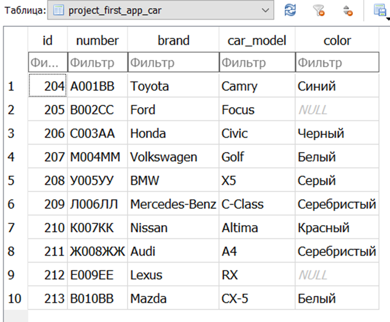
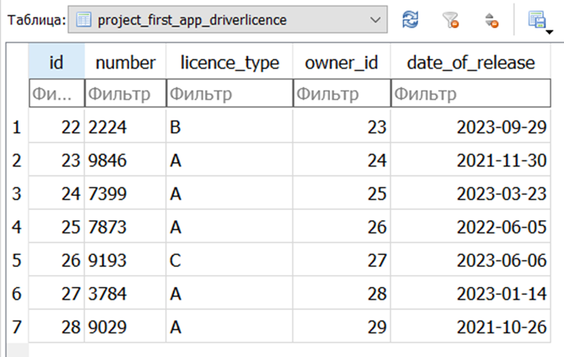
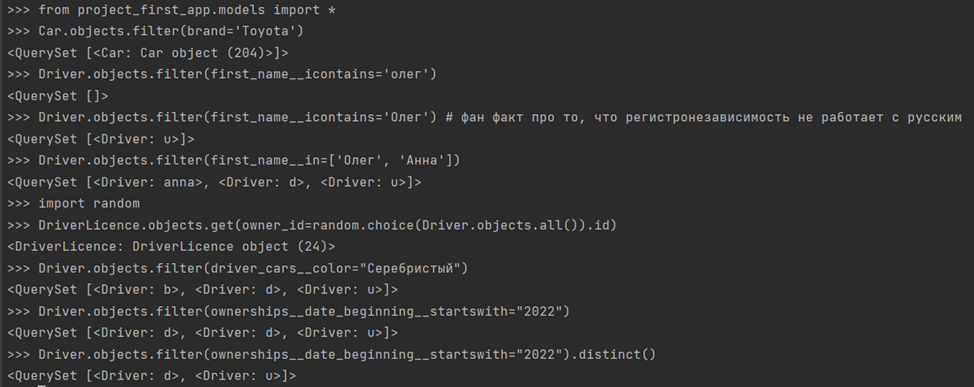
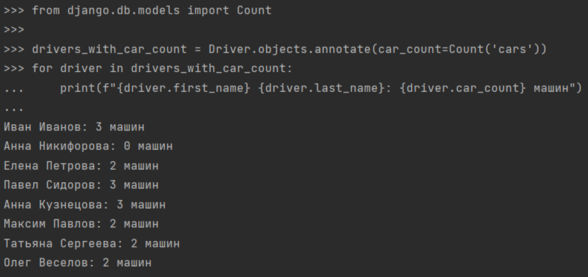
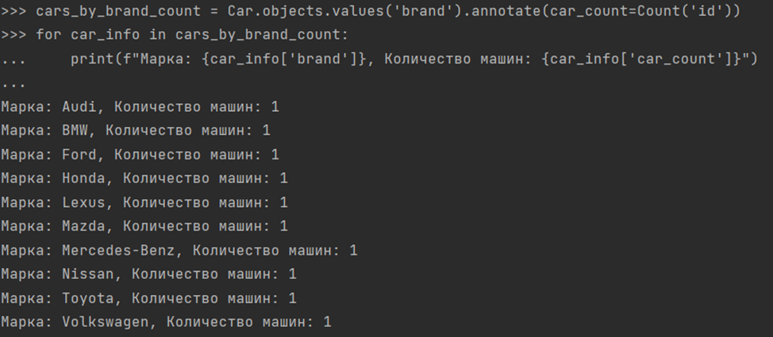

**Задание 1**

Выполнять задание было решено с помощью скрипта на Python. ля того, чтобы скрипт запустился, его необходимо расположить в корне проекта рядом с manage.py, а также прописать settings  переменную среды.

Скрипт:
```python
import os
import django
from django.utils import timezone
from datetime import timedelta
from datetime import datetime
import random

os.environ["DJANGO_SETTINGS_MODULE"] = "django_project_Nikiforova.settings"
django.setup()

from project_first_app.models import *


def random_date(start, end):
    return start + timedelta(seconds=random.randint(0, int((end - start).total_seconds())))


def create_driver(username, password, first_name, last_name, date_of_birth=None,  # drivers are users, yep
                  passport_number=None, address=None, nationality=None):
    driver = Driver(username=username, password=password, first_name=first_name, last_name=last_name,
                    date_of_birth=date_of_birth, passport_number=passport_number, address=address,
                    nationality=nationality)
    driver.save()
    return driver


def create_car(number, brand, car_model, color=None):
    car = Car(number=number, brand=brand, car_model=car_model, color=color)
    car.save()
    return car


def create_driver_licence(owner, number, licence_type, date_of_release=timezone.now()):
    licence = DriverLicence(owner=owner, number=number, licence_type=licence_type, date_of_release=date_of_release)
    licence.save()
    return licence


def create_ownership(driver, car, date_beginning, date_end):
    ownership = Ownership(driver=driver, car=car, date_beginning=date_beginning, date_end=date_end)
    ownership.save()
    return ownership


if __name__ == '__main__':
    # 'python manage.py shell' in terminal
    # 'from project_first_app.models import *' in terminal
    # data generated with the help of LLM, sorry I have zero ideas of my own
    # if the script gives 'database is locked' close every other programm accessing the database. sqlite issues

    cars_data = [
        {"number": "А001ВВ", "brand": "Toyota", "car_model": "Camry", "color": "Синий"},
        {"number": "В002СС", "brand": "Ford", "car_model": "Focus"},
        {"number": "С003АА", "brand": "Honda", "car_model": "Civic", "color": "Черный"},
        {"number": "М004ММ", "brand": "Volkswagen", "car_model": "Golf", "color": "Белый"},
        {"number": "У005УУ", "brand": "BMW", "car_model": "X5", "color": "Серый"},
        {"number": "Л006ЛЛ", "brand": "Mercedes-Benz", "car_model": "C-Class", "color": "Серебристый"},
        {"number": "К007КК", "brand": "Nissan", "car_model": "Altima", "color": "Красный"},
        {"number": "Ж008ЖЖ", "brand": "Audi", "car_model": "A4", "color": "Серебристый"},
        {"number": "Е009ЕЕ", "brand": "Lexus", "car_model": "RX"},
        {"number": "В010ВВ", "brand": "Mazda", "car_model": "CX-5", "color": "Белый"},
    ]

    for car_data in cars_data:
        car = create_car(**car_data)

    drivers_data = [
        {"username": "a", "password": "whatever", "first_name": "Иван", "last_name": "Иванов",
         "date_of_birth": timezone.now() - timedelta(days=random.randint(18 * 365, 30 * 365)),
         "passport_number": "12345", "address": "Москва"},
        {"username": "b", "password": "whatever", "first_name": "Елена", "last_name": "Петрова",
         "date_of_birth": timezone.now() - timedelta(days=random.randint(18 * 365, 30 * 365)),
         "passport_number": "54321", "address": "Санкт-Петербург", "nationality": "Россия"},
        {"username": "c", "password": "whatever", "first_name": "Павел", "last_name": "Сидоров",
         "date_of_birth": timezone.now() - timedelta(days=random.randint(18 * 365, 30 * 365)),
         "passport_number": "67890", "nationality": "Россия"},
        {"username": "d", "password": "whatever", "first_name": "Анна", "last_name": "Кузнецова",
         "date_of_birth": timezone.now() - timedelta(days=random.randint(18 * 365, 30 * 365)),
         "passport_number": "13579"},
        {"username": "e", "password": "whatever", "first_name": "Максим", "last_name": "Павлов",
         "date_of_birth": timezone.now() - timedelta(days=random.randint(18 * 365, 30 * 365)),
         "passport_number": "24680", "address": "Екатеринбург", "nationality": "Россия"},
        {"username": "f", "password": "whatever", "first_name": "Татьяна", "last_name": "Сергеева",
         "passport_number": "86420", "address": "Ростов-на-Дону", "nationality": "Россия"},
        {"username": "u", "password": "whatever", "first_name": "Олег", "last_name": "Веселов",
         "passport_number": "86120"},
    ]

    for driver_data in drivers_data:
        driver = create_driver(**driver_data)
        driver_licence = create_driver_licence(driver, str(random.randint(1000, 9999)), random.choice("ABCD"),
                                               random_date(timezone.now() - timedelta(days=2 * 365, weeks=4),
                                                           timezone.now() - timedelta(weeks=4)))

        for _ in range(random.randint(1, 3)):
            car = random.choice(Car.objects.all())

            if car.ownerships.all():  # попытка ограничения, чтобы одной машиной не владели одновременно несколько людей
                if random.choice([0, 1]):
                    date_beginning = max([own.date_end for own in car.ownerships.all()])
                    date_end = date_beginning + timedelta(weeks=random.randint(4, 16))
                else:
                    date_end = min([own.date_beginning for own in car.ownerships.all()])
                    date_beginning = date_end - timedelta(weeks=random.randint(4, 16))
                ownership_start = max(date_beginning, min(date_end, datetime.date(driver_licence.date_of_release)))
                ownership_end = min(date_end, ownership_start + timedelta(weeks=random.randint(4, 16)))
            else:
                ownership_start = random_date(driver_licence.date_of_release, driver_licence.date_of_release +
                                              timedelta(weeks=random.randint(4, 16)))
                ownership_end = random_date(ownership_start, ownership_start + timedelta(weeks=random.randint(4, 16)))

            if ownership_start > ownership_end:
                ownership_start, ownership_end = ownership_end, ownership_start

            create_ownership(driver, car, ownership_start, ownership_end)

    print("Done!")
```

Содержимое базы после выполнения кода:

Автомобиль


Автовладелец


Водительское_удостоверение


Владение


**Задание 2**

Введение необходимых related_names (models.py):

```python
class Driver(AbstractUser):
    …
    cars = models.ManyToManyField('Car', through='Ownership', related_name='owners')


class DriverLicence(models.Model):
    owner = models.ForeignKey('Driver', on_delete=models.CASCADE, related_name='driver_licences')
    …


class Car(models.Model):
    …
    drivers = models.ManyToManyField('Driver', through='Ownership', related_name='driver_cars')


class Ownership(models.Model):
    car = models.ForeignKey('Car', on_delete=models.CASCADE, related_name='ownerships')
    driver = models.ForeignKey('Driver', on_delete=models.CASCADE, related_name='ownerships')
    …
```
Выполнение:



**Задание 3**

Выполнение:





