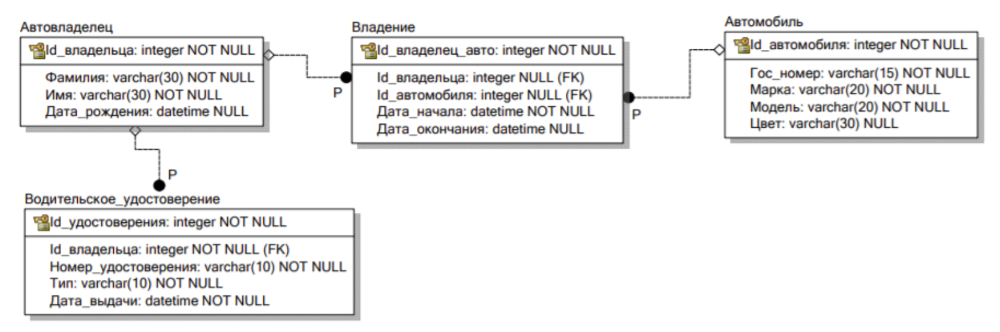

**Практическое занятие №3.1**
Django Web framework. Запросы и их выполнение.

**Практическое задание 1**:

Воспользуйтесь проектом из практики 2.1:

Напишите запрос на создание 6-7 новых автовладельцев и 5-6 автомобилей, каждому автовладельцу назначьте удостоверение и от 1 до 3 автомобилей. Задание можете выполнить либо в интерактивном режиме интерпретатора, либо в отдельном python-файле. Результатом должны стать запросы и отображение созданных объектов. 
Если вы добавляете автомобили владельцу через метод .add(), не забудьте заполнить также ассоциативную сущность “владение”

**Практическое задание 2**: 

По созданным в пр.1 данным написать следующие запросы на фильтрацию:
<li>Где это необходимо, добавьте related_name к полям модели</li>
<li>Выведете все машины марки “Toyota” (или любой другой марки, которая у вас есть)</li>
<li>Найти всех водителей с именем “Олег” (или любым другим именем на ваше усмотрение)</li>
<li>Взяв любого случайного владельца получить его id, и по этому id получить экземпляр удостоверения в виде объекта модели (можно в 2 запроса)</li>
<li>Вывести всех владельцев красных машин (или любого другого цвета, который у вас присутствует)</li>
<li>Найти всех владельцев, чей год владения машиной начинается с 2010 (или любой другой год, который присутствует у вас в базе)</li>

**Практическое задание 3**:

Необходимо реализовать следующие запросы c применением описанных методов:
<li>Вывод даты выдачи самого старшего водительского удостоверения</li>
<li>Укажите самую позднюю дату владения машиной, имеющую какую-то из существующих моделей в вашей базе</li>
<li>Выведите количество машин для каждого водителя</li>
<li>Подсчитайте количество машин каждой марки</li>
<li>Отсортируйте всех автовладельцев по дате выдачи удостоверения (Примечание: чтобы не выводить несколько раз одни и те же таблицы воспользуйтесь методом .distinct()</li>
